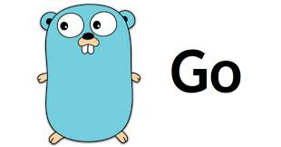
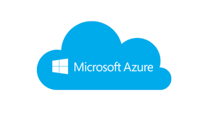
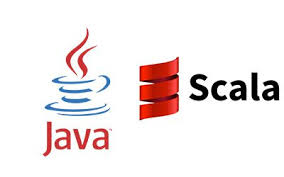
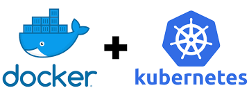

# Hi there 👋 I'm Nick Dalalelis

Welcome to my GitHub Profile! I hope you find something here that interests you.

A little bit about myself. I'm a full stack cloud software engineer specializing in **designing and implementing distributed and scalable web applications** targeted to run in the **cloud** using a variety of **modern programming languages**. Some of my contributions include the following:

* Big data projects at Bloomberg and HPE
* Cloud infrastructure and DevOps at Verizon
* Cloud based applications at Microsoft

## :heart_decoration: Some of my favorite technologies are:

| Cloud | Programming |
| :---: | :---: |
| | 
|  | 
| | 
|| |

## Projects

Here are some of my projects that I find interesting. Some of these projects make it to my [blog at nickthecloudguy.com](https://www.nickthecloudguy.com/).

| Project | Description | Technologies | GitHub |
| :---: | :---: | :---: | :---: |
| Azure Experiments | A playground to experiment and learn with code examples using technologies like serverless and OpenAI on Azure | Azure, Kubernetes, Golang, Java | [nickdala/azure-experiments](https://github.com/nickdala/azure-experiments)
| Event Driven Architecture With Azure Container Apps | Event driven sample using Azure Blob Storage, Event Grid, and Container App Job. | Azure Container Apps, Azure Event Grid, Azure Storage - Blobs & Queues | [nickdala/azure-container-apps-event-driven-architecture](https://github.com/nickdala/azure-experiments/tree/main/samples/blob-event-grid-container-app)
| Piggy Bank LangChain for Java | A Java implementation of the Bank using OpenAI and LangChain4j | Java, LangChain4J, OpenAI, Spring Boot | [nickdala/piggy-bank-langchain-java](https://github.com/nickdala/piggy-bank-langchain4j)
| AWS Lambda, Step Functions, DynamoDB, and CDK! | Simple project of an AWS Lambda triggering the execution of a Step Function. | AWS Lambda, Step Functions, DynamoDB, CDK, TypeScript | [nickdala/aws-lambda-step-function-dynamodb-cdk](https://github.com/nickdala/aws-lambda-step-function-dynamodb)
|AWS Cloud Development Kit (CDK) Example to Deploy EC2 and VPC Resources | Demonstrates how to use the AWS CDK to deploy a VPC with subnets, security groups and EC2 instances.  | AWS VPC, EC2, CDK | [nickdala/aws-cdk-vpc-example](https://github.com/nickdala/aws-cdk-vpc-example)
| Hello Istio | A simple hello world application that demonstrates the use of Istio service mesh | Istio, Kubernetes, Docker, Golang | [nickdala/hello-istio](https://github.com/nickdala/helloworld-istio)

## Collaboration

I'm always looking to collaborate on interesting projects. Learning by experimenting and sharing knowledge is a passion of mine. At **Microsoft**, I was one of the main contributors to the [patented cloud based applications](https://patents.google.com/patent/US20140164480A1/en) project.

I'm happy to chat and collaborate with others. Feel free to reach out to me on [LinkedIn](https://www.linkedin.com/in/nickdala/).

<!--
**nickdala/nickdala** is a ✨ _special_ ✨ repository because its `README.md` (this file) appears on your GitHub profile.

Here are some ideas to get you started:

- 🔭 I’m currently working on ...
- 🌱 I’m currently learning ...
- 👯 I’m looking to collaborate on ...
- 🤔 I’m looking for help with ...
- 💬 Ask me about ...
- 📫 How to reach me: ...
- 😄 Pronouns: ...
- ⚡ Fun fact: ...
-->
