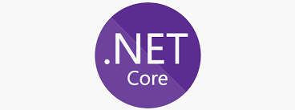

# About Me

Hi there 👋 I'm Nick Dalalelis, a full stack cloud software engineer. I specialize in **designing and implementing distributed and scalable web applications** targeted to run in the **cloud** using a variety of **modern programming languages**.

Since the start of my career, I have been an advocate for developing robust commercial quality software, with a focus on reliability, scalability and supportability.  Some of my contributions include the following:

* Big data projects at Bloomberg and HPE
* Cloud infrastructure and DevOps at Verizon
* Cloud based applications at Microsoft

## :heart_decoration: Some of my favorite technologies are:

| Cloud | Programming |
| :---: | :---: |
| | 
|  | 
| | 
|| |

## Collaboration

I'm always looking to collaborate on interesting projects. Learning by experimenting and sharing knowledge is a passion of mine. At **Microsoft**, I was one of the main contributors to the [cloud based applications](https://patents.google.com/patent/US20140164480A1/en) project. This ultimately led to a patent being filed.

<!--
**nickdala/nickdala** is a ✨ _special_ ✨ repository because its `README.md` (this file) appears on your GitHub profile.

Here are some ideas to get you started:

- 🔭 I’m currently working on ...
- 🌱 I’m currently learning ...
- 👯 I’m looking to collaborate on ...
- 🤔 I’m looking for help with ...
- 💬 Ask me about ...
- 📫 How to reach me: ...
- 😄 Pronouns: ...
- ⚡ Fun fact: ...
-->
